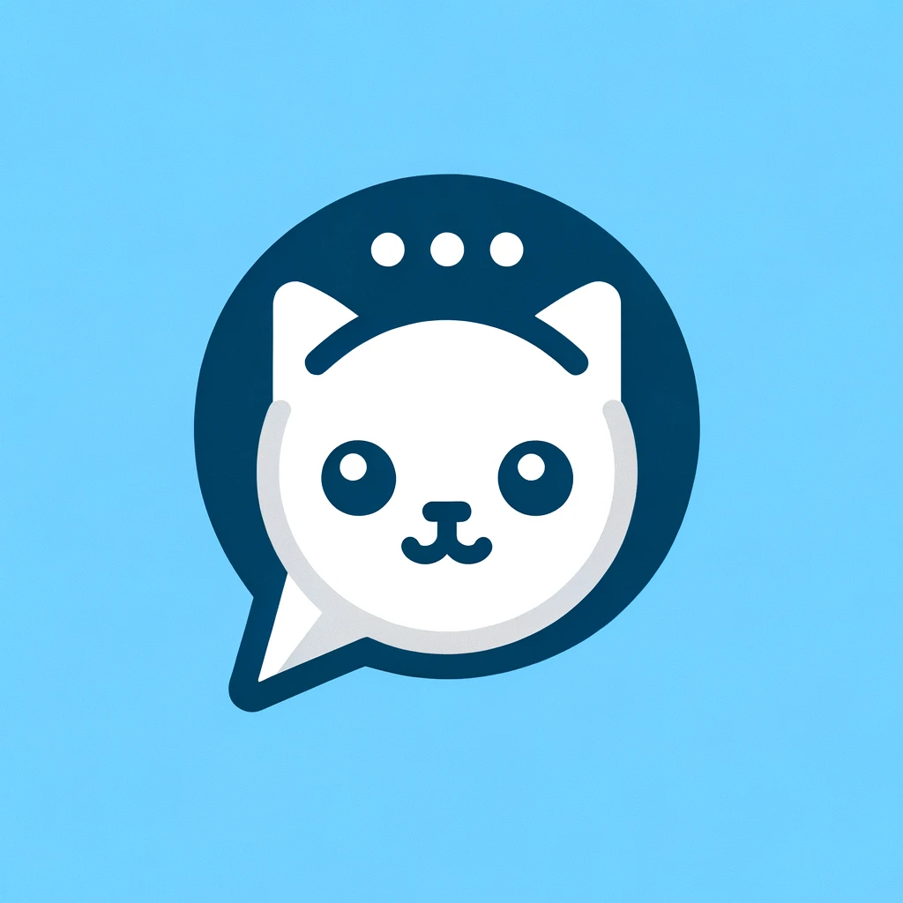

# Fellow-chat




## Описание

Fellow-chat - это бэкенд для чата, реализованный с использованием WebSocket. Проект демонстрирует, насколько просто
можно писать приложения на WebSocket.

## Демонстрация

Проект уже развернут и доступен по ссылке: https://chat.vsezol.com/user

## Технологии

- Spring
- Kotlin
- MongoDB

## Инструкции по установке

1. Сборка проекта с помощью Gradle:
    ```bash
   gradle build # Важно выполнить этот шаг для уменьшения итогового размера Docker-образа.
   docker build -t svalka.cr.cloud.ru/giga-fellow-chat:latest . # Сборка Docker-образа:
   docker-compose up # Запуск с помощью Docker Compose:
   docker-compose up -d # Можно добавить флаг `-d` для запуска в фоновом режиме:

## Авторы

- Константин Алаев
    - Telegram: @alaev_dev
    - Email: alaevdev@gmail.com
- Всеволод Золотов
    - Telegram: @vsezold

## Контакты

Если у вас есть вопросы или предложения, пожалуйста, свяжитесь со мной.

---
